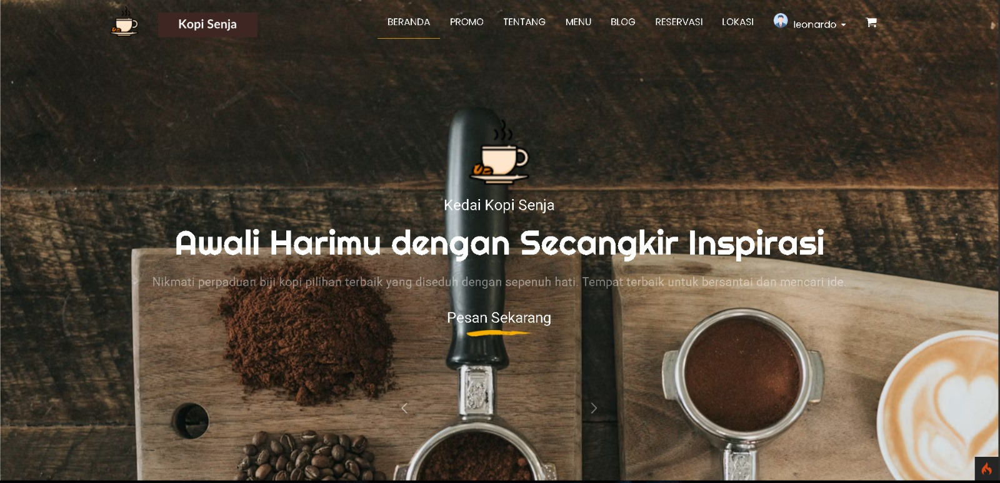
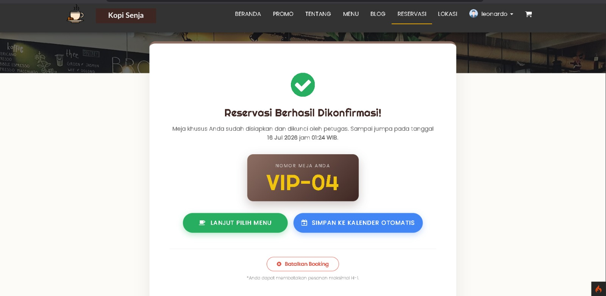
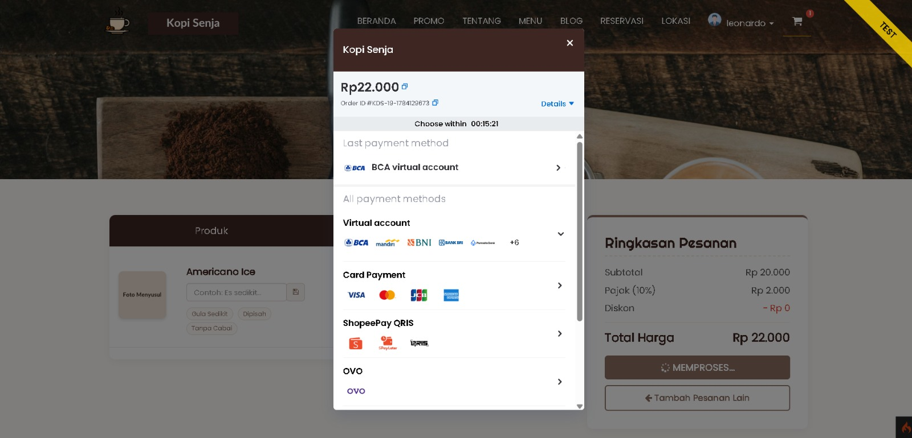
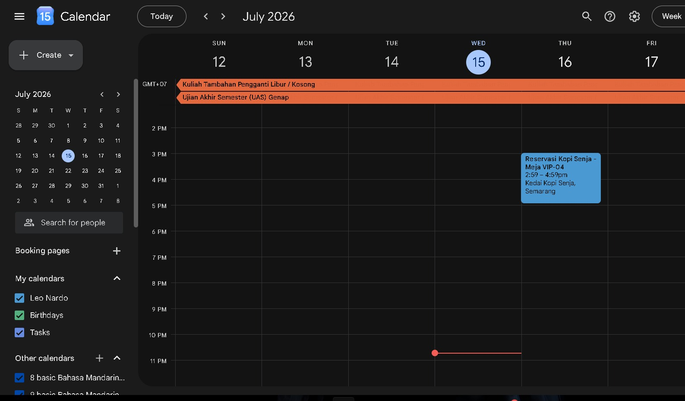
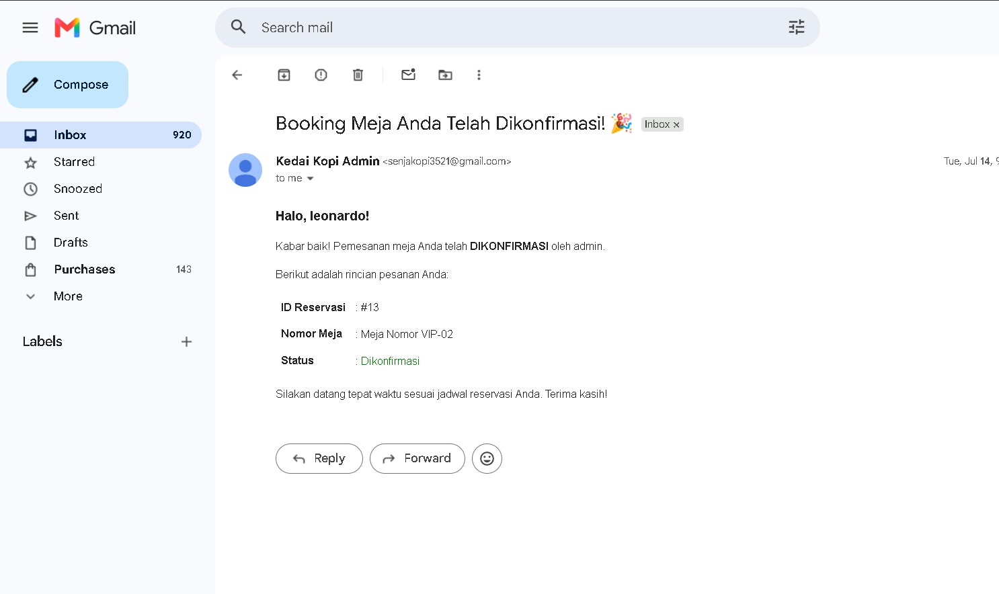
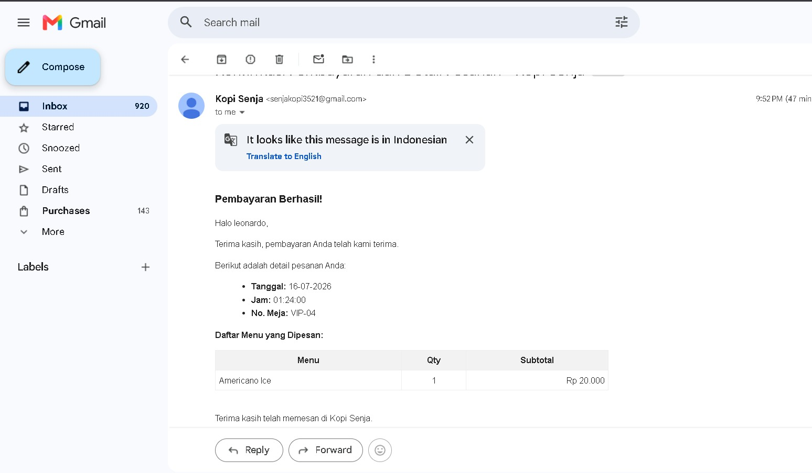

# ☕ Kedai Kopi Senja - Aplikasi Pelanggan

Ini adalah repositori untuk sisi **Pelanggan (User)** dari sistem informasi Kedai Kopi Senja. Aplikasi ini dirancang agar pelanggan dapat dengan mudah melihat katalog menu, melakukan pemesanan, dan membuat reservasi tempat secara _online_ yang terintegrasi dengan berbagai layanan pihak ketiga.

---

## ✨ Fitur Utama

- Katalog Menu interaktif.
- Sistem Reservasi Tempat terintegrasi Google Calendar.
- Pembayaran _Online_ (Payment Gateway) menggunakan Midtrans.
- Notifikasi pemesanan dan pembayaran via Email (SMTP).

---

## 🚀 Cara Instalasi

Ikuti panduan berikut untuk menjalankan proyek ini di _local environment_ Anda:

### 1. Persiapan Repositori

Lakukan _clone repository_ ini ke direktori lokal Anda:

```bash
git clone https://github.com/Nardo4577/toko_kopi_user.git
cd toko_kopi_user
```

### 2. Instalasi Dependensi

Pastikan Anda sudah menginstal Composer. Jalankan perintah berikut untuk mengunduh semua _library_ yang dibutuhkan (termasuk _library shopping cart_ CodeIgniter 4):

```bash
composer install
```

---

## ⚙️ Konfigurasi Lingkungan (`.env`)

Untuk alasan keamanan, _file_ `.env` tidak disertakan di GitHub. Anda harus mengaturnya secara manual.

1. Salin _file_ _template_ lingkungan dan ubah namanya menjadi `.env`:
   ```bash
   cp env.example .env
   ```
2. Buka _file_ `.env` dan atur konfigurasi berikut dengan kredensial milik Anda:

**Pengaturan Database**

```env
database.default.database = toko_kopi
database.default.username = root
database.default.password =
```

**Pengaturan SMTP (Notifikasi Email)**

```env
email.protocol   = 'smtp'
email.SMTPHost   = 'smtp.gmail.com'
email.SMTPUser   = 'senjakopi3521@gmail.com'
email.SMTPPass   = '<MASUKKAN_APP_PASSWORD_GMAIL_ANDA_DI_SINI>'
email.SMTPPort   = 465
email.SMTPCrypto = 'ssl'
email.mailType   = 'html'
```

**Pengaturan Payment Gateway (Midtrans Sandbox)**

```env
MIDTRANS_SERVER_KEY="<MASUKKAN_SERVER_KEY_MIDTRANS_ANDA>"
MIDTRANS_CLIENT_KEY="<MASUKKAN_CLIENT_KEY_MIDTRANS_ANDA>"
MIDTRANS_IS_PRODUCTION=false
```

**Pengaturan Google Calendar API**

```env
GOOGLE_CLIENT_ID="<MASUKKAN_GOOGLE_CLIENT_ID_ANDA>"
GOOGLE_CLIENT_SECRET="<MASUKKAN_GOOGLE_CLIENT_SECRET_ANDA>"
GOOGLE_REDIRECT_URI="https://kopisenja-user.infinityfreeapp.com/google-calendar/callback"
```

---

## 🗄️ Database Migrations & Seeder

Pastikan Anda sudah membuat _database_ kosong dengan nama `toko_kopi` di MySQL/phpMyAdmin Anda (_database_ ini berbagi (_shared_) dengan aplikasi Admin).

Untuk membuat struktur tabel dan mengisi data awal (_dummy_), jalankan perintah berikut di terminal:

```bash
php spark migrate
php spark db:seed App\Database\Seeds\UserSeeder
```

---

## 🔐 Akun Demo & Skenario Pengujian

Jika Anda ingin langsung menguji aplikasi tanpa mendaftar, gunakan akun _dummy_ berikut:

- **Username:** `andi`
- **Password:** `user123`

> **💡 Rekomendasi Pengujian Menyeluruh:**
> Untuk memastikan notifikasi _email_, konfirmasi Midtrans, dan API kalender berjalan normal, **disarankan untuk membuat akun baru**.
>
> 1. Klik menu **Login** -> **Daftar Sekarang**.
> 2. Masukkan **Email Aktif** Anda agar notifikasi SMTP bisa masuk ke _inbox_.
> 3. Lakukan _login_ menggunakan akun yang baru saja dibuat dan cobalah membuat reservasi.

---

## 📸 Tampilan Antarmuka (Screenshots)

Berikut adalah beberapa pratinjau dari antarmuka dan fitur aplikasi:

### Halaman Utama (Katalog Menu)



### Detail Setelah Pemesanan / Reservasi



### Integrasi Pembayaran (Midtrans)



### Sinkronisasi Google Calendar



### Bukti Notifikasi Email Reservasi



### Bukti Notifikasi Email Transaksi Pembayaran


